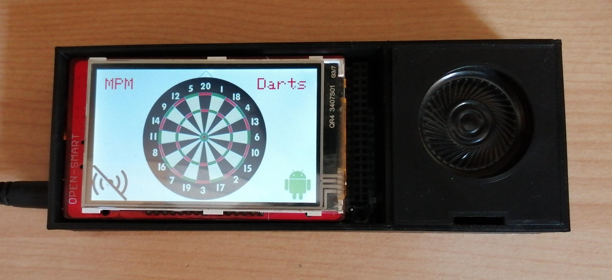
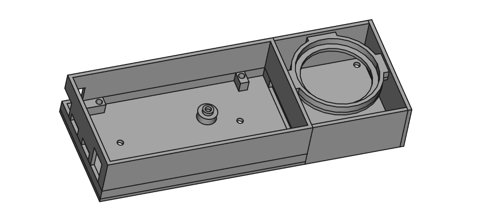
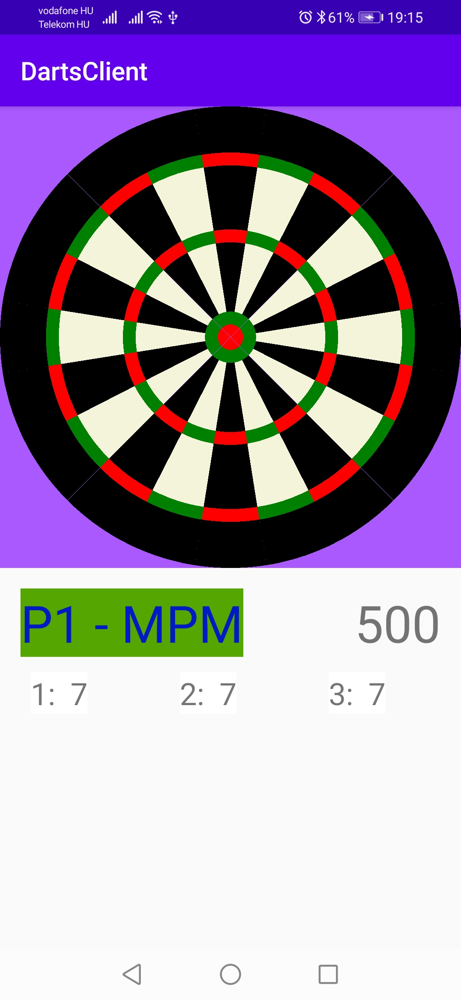

# Darts with Arduino

 

  

This is a hobby project which transforms a generic electronic dartboard to a smart one with the help of an Arduino Due.

The goal of the project is to create an application which can replace the default software of any dartboard. The application is developed as a [PlatformIO](https://platformio.org/) project.

Moreover another important aspect of the project is the simple extendibility of the games.

## Android companion app

A companion Android client is also in development (however it's currently not prioritized) which can communicate with the board through Bluetooth with JSON messages. The client is written in Kotlin.

The main features of the app:
* create player profiles and save match outcomes and create statistics
* use it as a remote controller for the board
* showing current state of the game

The match outcomes and player profiles are stored in a SQLite database.

## Games

I'm planning to enchance and reorganize this section into a wiki. But until then here are a few words about the games.

### 301, 501, etc.
The classic games, the goal is to reduce the starting score exactly to zero.
Double in/double out modes are supported.

### Round the Clock

Throwing darts in order from 1 to 20 + bullseye.

Variant: shoot-out (randomly generated numbers, first to win 21 points win)

### Cricket

In the classic cricket game the goal is to *close* a sector (throw 3 darts in the same sector) and then score as many points as possible in the same sector until the other player closes it too.

After every valid sector (in the classic version 15-20 + bullseye) is closed the player with the more points win.

Variants: no score (first player to close every sectors win), cut-throat (undeveloped yet)

## Hardware setup

There are multiple reasons why the Due was choosen:
* it can output true analog output hence it can be used to produce sound with speakers
* a small screen can be attached
* there are additional pins which are needed for the board signals

### Board-connection
Dartboards work in the same way as simple keyboards: the board has two slim plastic sheets which have proper circuits (mine have carbon-printed) that can process the thrown dart.
If a dart is thrown the two sheets touch each other at a specific point and technically one route of each sheet are connected for a short time when this happpens.

The basic working principle of the boards is the following: one sheet is an "input sheet" with *m* routes/connectors and the other is an "output sheet" with *n* routes/connectors.
The sheets are constructed in way that when one specific field is hit by a dart then one specific route on the input sheet is connected to an other specific route on the output sheet.

There are 20×3 + 2 = 62 fields (not counting the outer zero field) which means *m*×*n* needs to be equal with or larger than 62.
There is no universal values for *m* and *n* there are different designs but for my board they are *m*=8 and *n*=8. Technically there is no difference between the input and output sheets, they are interchangable.
(Currently no other *m*×*n* resolution is supported. The problem is that different boards probably have different mappings which are need to be programmed manually. Even the current 8×8 mapping is not guaranteed to work for every model.)

FFC (flexible flat cable) connectors ared used for connecting to the sheets. There are jumper cables soldered to the connectors which are attached to the Due on the other end.

In order to process the thrown dart with the Due we need to detect a connection between two pins in this way:
* the pins which are connected to the board's input sheet are need to be configured as OUTPUT
* the pins which are connected to the board's output sheet are need to be configured as INPUT
* ciclically iterate through each OUTPUT pin: write HIGH for a short time (milliseconds depends on board) then turn off with writing LOW
* detect HIGH level on INPUT pins, if that happens a dart hit the board, the two sheets were connected so check which OUTPUT pin is active: now it's known which input and output is connected -> look up the proper field value from map 

This process was not written from scratch: the problem was solved with the [Keypad library](#dependencieslibraries).

### Display + touchscreen + SD card

The projects uses a "complex" display shield it needs to have touchscreen capabilites and an integrated SD card shield. The project expected to be used with shields which have [MCUFriend drivers](#dependencieslibraries). 

The touchscreen capabilites are neded as it's the only interface for players to interract with it (apart from the Android client).
For the touch input a custom calibrating method was written: currently the eight raw touch raw values are needed to be set the *x* and *y* raw values for each four corners.
With the help of this raw values from a generic quadrilateral are transformed to the screen rectangle.

A micro SD card slot is also required on the shield as resources (texts, images and sound effects) are stored on a SD card.
The display covers the SD pins so it is not possible to use an SD shield on its own.

### Bluetooth receiver
As mentioned the Bluetooth receiver is used to communicate with the companion Android client. I used a [HC-06 module](https://www.olimex.com/Products/Components/RF/BLUETOOTH-SERIAL-HC-06/resources/hc06.pdf).
This devices communicates through a serial port so it can be easily replaced with an other type if that one also supports serial communicating.

The device can be configured with AT commands (through Serial messages): the device name, password, baud rate, etc. can be changed this way. The complete AT command list can be found on the aforementioned url.

### Audio amplifier + speaker

The audio needs to be amplifed for the speaker as it can't work properly when the speaker is directly attached to the output pin + ground (also without the amplifier-circuit the Arduino can be permanently damaged).

I bought a generic LM386 audio-amplifer panel from China which works well enough. The speaker is also a generic cheap one from China (8 Ω and 0.5 watts).

### 3D printed holder
I designed a [simple holder](./DartsBoard/3D%20printed%20model) which can hold the complete hardware setup. The model was designed with [FreeCad](https://www.freecadweb.org/). 

The holder constists of two compartments:
* one holds the Due and the screen (there are holes for Due's ports and the reset button)
* the other holds the speaker, the amplifier and the blutooth module
(for this compartment there is also a simple case which hides the components and fixes the speaker's position, i.e.: it prevents the speaker from falling out)

There are also holes (Ø 3mm) for screws which can be used to fix the holder to a wall.

### Assembling 
The Due + display shield should fit tightly inside the holder (but some of the holes on the holder are behind the holes of the Due making it possible to fix it firmly).

The audio amplifier and Bluetooth module's connection to the Due is a bit tricky:
* firstly, the Bluetooth can be used with a software serial library, in this case the four cables can be attached next to board pins on the right side of the Due
* if the software serial solution is not satisfying enough the cables are needed to be soldered to one of the hardware serial ports at the bottom of the Due (because the display covers them)
* in the case of the audio amplifier's connecting: there is no other way than to solder cables to bottom of the Due's pins

### Powering
Only the Due is needed to be powered: it can be powered with 7-12 volts on the power jack or with 5 volts on one of the micro usb ports.

## Software setup
### Dependencies/Libraries

The following libraries are needed, they can be installed directly from the Arduino IDE's library manager:
* [Audio](https://github.com/arduino-libraries/Audio) - used to prouduce sound effects
* [ArduinoJSON](https://github.com/bblanchon/ArduinoJson) - used for the communicatition between the Arduino and the Android client
* [ArduinoQueue](https://github.com/EinarArnason/ArduinoQueue) - used to create queues
* [SD](https://github.com/arduino-libraries/SD) - used to handle sd card read/write processes (see the [Config file](./DartsBoard/src/Configuration.h) and [DisplayContainer](./DartsBoard/src/app/Hardware/DisplayContainer.cpp))
* [Keypad](https://www.arduino.cc/reference/en/libraries/keypad/) - used to handle dart input (see the [Config file](./DartsBoard/src/Configuration.h) and [BoardContainer](./DartsBoard/src/app/Hardware/BoardContainer.cpp))
* [Adafruit TouchScreen Library](https://github.com/adafruit/Adafruit_TouchScreen) - used to handle touch inputs on the display
* [Adafruit GFX Library](https://github.com/adafruit/Adafruit-GFX-Library) - used to create gui buttons
* [Adafruit Bus IO](https://github.com/adafruit/Adafruit_BusIO) - used by the other Adafruit libraries
* [MCUFRIEND_kbv](https://github.com/prenticedavid/MCUFRIEND_kbv) - driver for the display (To configure it see the project's ReadMe)

### Resources

A simple resource system was implemented for this project. It's possible to load different collections of texts and audio files which are on the SD card (this is not documented yet).

The resources can be found [here](./DartsBoard/res). Just simply copy this folder to the SD card and it should work without a problem. 

However, the sound effects are not created yet it is a task for the future.

## Gallery

   --   |   Hardware   |  Android Client
:-------------------------:|:-------------------------:|:-------------------------:
Photos |    |  

## To-Do

* Replace string resources to primitive char array
* Make configuring the project easier
* Add sound effects
* Create an user-manual wiki
* Create in-depth documentation for the source code + configuring
* Fix Android client and clean it up
* Add pictures about Android client, 3D model, assembly etc.
